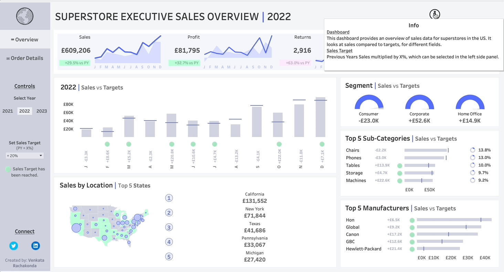
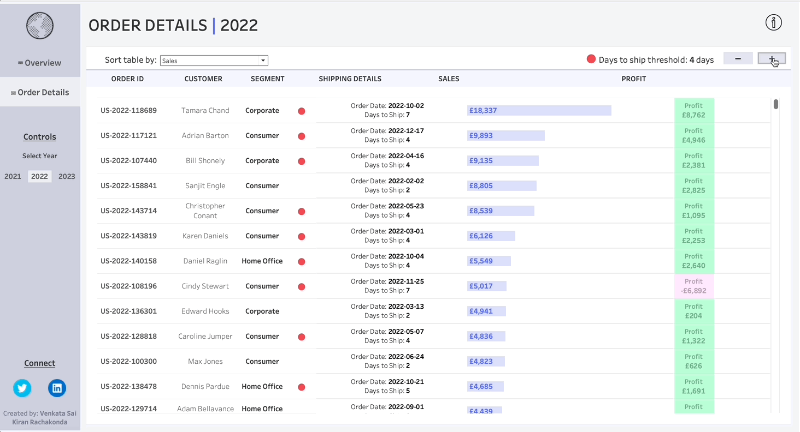

# Sales and Order Details Dashboards

## Overview
This repository contains the implementation of two key business intelligence dashboards: the **Sales Executive Dashboard** and the **Order Details Dashboard**. These dashboards provide in-depth insights into the sales performance and order management of a business.

## Sales Executive Dashboard

### Features
- **Total Sales**: Displays the total sales figures over a specific period.
- **Profit**: Visualizes net profit margins.
- **Returns**: Analyzes product returns and return reasons.
- **Quantity Sold**: Shows the total quantity of products sold.
- **Sales vs Target**: Compares actual sales against predefined targets.
- **Sales by Location**: Maps sales distribution across different regions.
- **Top 5 Manufacturers**: Highlights the top five manufacturers based on sales.

### Interactivity
- Filters for date range, location, product category.
- Drill-down functionality for detailed insights.

## Order Details Dashboard

### Features
- **Order ID**: Unique identifier for each order.
- **Customer Information**: Details of the customer placing the order.
- **Segment**: Customer segment classification.
- **Shipping Details**: Information about shipping method, duration, and status.
- **Sales**: Sales amount for each order.
- **Profit**: Profit generated from each order.
- **Days to Ship**: Time taken from order placement to shipment.

### Dashboard Functionality
- Interactive elements to explore individual order details.
- Filters to view orders based on different criteria such as date, customer, and shipping status.
- Visualization of key metrics related to order processing and fulfillment.

## Getting Started

### Prerequisites
- Business Intelligence tool like Tableau or Power BI.
- Access to the company's sales and order management systems.

### Installation
- Clone this repository:
